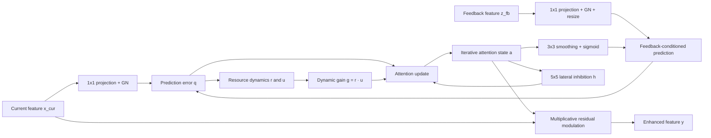

<div align="center">

# TCPELIA

### Thalamo-Cortical Predictive Error Lateral-Inhibition Attention

**A feedback-driven, predictive-error attention module for visual feature enhancement in PyTorch**

[中文说明](README_CN.md) · [Quick Start](#quick-start) · [How It Works](#how-it-works) · [Integration Guide](docs/ultralytics_integration.md) · [Tests](#testing)

</div>

---

## Overview

Visual evidence can be weak, sparse, or spatially fragmented in challenging recognition and detection scenarios. TCPELIA is a research attention block that combines **feedback-conditioned feature prediction**, **channel-aggregated predictive error**, **spatial lateral inhibition**, and **dynamic resource gating** to iteratively generate a spatial attention map.

The current and feedback features are projected into a common channel space. Prediction error drives attention formation, while a spatial inhibition term and two evolving resource variables regulate its strength. The resulting single-channel attention map multiplicatively enhances the **original** current feature tensor, preserving its channel count and spatial resolution.

> **Release scope:** This repository contains the standalone attention module copied from the supplied research implementation, runnable examples, tests, and an integration guide. It does **not** include training datasets, detector weights, a modified YOLO26 codebase, or independently verified detection benchmark results. The thalamo-cortical terminology describes a modeling inspiration, not a validated biological simulation.

## Highlights

- **Dual-source feature conditioning:** accepts a current feature and a feedback feature of different channel counts and spatial resolutions.
- **Predictive-error emphasis:** calculates a channel-mean squared mismatch between the current representation and feedback-conditioned prediction.
- **Neighborhood competition:** uses a fixed, normalized 5×5 kernel with a zero-valued center for lateral inhibition.
- **Stateful iterative refinement:** maintains attention, inhibition, resource availability, and utilization states during each forward pass.
- **Lightweight spatial modulation:** produces a `[B, 1, H, W]` map and preserves the original feature shape through multiplicative residual modulation.

## Architecture



*The feedback and attention state are updated within a fixed number of internal iterations; the diagram is conceptual rather than a one-to-one representation of each program statement.*

## How It Works

Let `x_cur` and `z_fb` be the current and feedback features. After independent 1×1 convolutions and group normalization, the feedback representation is bilinearly resized to match the current feature's spatial dimensions, if necessary:

$$x_r = \mathrm{GN}(\mathrm{Conv}_{1\times 1}(x_{cur})),\quad z_r = \mathrm{Resize}(\mathrm{GN}(\mathrm{Conv}_{1\times 1}(z_{fb}))).$$

At iteration $t$, the feedback response and prediction are

$$f_t=\sigma(\mathrm{Conv}_{3\times 3}(a_t)),\qquad \hat{x}_t=z_r\odot(1+\rho f_t).$$

Prediction error is the channel-mean squared residual:

$$q_t=\frac{1}{c_r}\sum_{c=1}^{c_r}(x_{r,c}-\hat{x}_{t,c})^2.$$

Lateral inhibition evolves from the **previous** attention state:

$$h_{t+1}=(1-\eta_h)h_t+\eta_h(K_{inh}*a_t),\qquad \eta_h=\frac{1}{\tau_h}.$$

The fixed $5\times 5$ inhibition kernel $K_{inh}$ is normalized to sum to one and has a **zero center weight**. Resource availability and utilization are updated as

$$r_{t+1}=\mathrm{clip}_{[0,1]}\left(r_t+\frac{1-r_t}{\tau_d}-u_t r_t q_t\right),$$

$$u_{t+1}=\mathrm{clip}_{[U_0,1]}\left(u_t+\frac{U_0-u_t}{\tau_f}+U_f(1-u_t)q_t\right).$$

These states produce a dynamic gain $g_t=r_{t+1}u_{t+1}$. Attention is refined with inhibition:

$$a_{t+1}=(1-\eta_a)a_t+\eta_a\sigma(\alpha g_tq_t-\beta h_{t+1}),\quad \eta_a=\frac{1}{\tau_a}.$$

After the last iteration, TCPELIA returns

$$\boxed{y=x_{cur}\odot(1+\lambda a_T)}.$$

The stored `model.attn_map` is a **detached copy** of the last attention tensor for inspection. The forward output itself remains differentiable through the attention computation.

## Quick Start

### Install

Python 3.9+ and PyTorch 2.0+ are listed as project requirements. Actual compatibility depends on the installed PyTorch build and hardware.

```bash
git clone https://github.com/<YOUR_USERNAME>/TCPELIA.git
cd TCPELIA
python -m pip install -e .
```

Replace `<YOUR_USERNAME>` with the owner of your GitHub repository after publishing. Alternatively, install locally from the downloaded folder without cloning.

### Standalone usage

```python
import torch
from tcpelia import TCPELIA

x_cur = torch.randn(1, 128, 40, 40)
z_fb = torch.randn(1, 256, 20, 20)

# Iteration count is explicitly set here; default constructor uses iters=5.
module = TCPELIA(c_x=128, c_z=256, c_r=64, iters=2)
y = module([x_cur, z_fb])

print(y.shape)                  # torch.Size([1, 128, 40, 40])
print(module.attn_map.shape)    # torch.Size([1, 1, 40, 40])
```

Run the supplied forward/backward demonstration:

```bash
python -m examples.quickstart
```

An attention-map visualization on **random synthetic features** is also included (it is not a trained detection heatmap):

```bash
python -m pip install matplotlib
python -m examples.visualize_attention
```

## Constructor Parameters

| Parameter | Default | Description |
| --- | ---: | --- |
| `c_x` | required | Input channel count of the current feature. |
| `c_z` | required | Input channel count of the feedback feature. |
| `c_r` | `64` | Shared projected channel count; must be divisible by 8 because `GroupNorm(8, c_r)` is used. |
| `iters` | `5` | Iterative refinement steps (**source YAML example specifies 2**). |
| `rho` | `0.5` | Scale of feedback-conditioned prediction modulation. |
| `alpha` | `2.0` | Scale applied to error-driven excitation. |
| `beta` | `1.0` | Scale of spatial inhibition. |
| `lam` | `0.75` | Final attention modulation strength. |
| `U0` / `Uf` | `0.2` / `0.2` | Resource utilization baseline / facilitation parameter. |
| `tau_a` / `tau_h` | `1.5` / `1.0` | Time constants for attention and inhibition. |
| `tau_d` / `tau_f` | `5.0` / `2.0` | Time constants for resource recovery and utilization. |

**Inputs:** `[x_cur, z_fb]` (preferred); passing a tensor alone uses it as both current and feedback features, so `c_z` must also match that tensor's channels. Both inputs must share the same batch size.

## YOLO26 / Ultralytics Integration

The source includes this illustrative model-YAML line:

```yaml
- [[15, 10], 1, TCPELIA, [64, 2]]
```

Here, `64` is `c_r` and `2` is `iters` **if the local model parser has been customized to instantiate** `TCPELIA(c_x, c_z, c_r, iters)`. The indices `15` and `10` are specific to the user's graph and must not be copied into unrelated architectures without verification.

**Important:** Merely adding this YAML line to a stock Ultralytics installation is *not* sufficient. The parser must recognize `TCPELIA`, resolve its **two input channel counts**, and pass both features to `forward`. See [the integration notes](docs/ultralytics_integration.md) for the explicit contract and a version-independent illustrative parser adaptation.

## Testing

```bash
python -m pip install -e . pytest
python -m pytest -q
```

The included tests exercise different iteration counts, mismatched spatial scales and channel counts, single-input fallback, gradient propagation, output modulation identity, normalized inhibition kernel, and checkpoint round-trip.

## Repository Layout

```text
TCPELIA/
├── tcpelia/
│   ├── __init__.py
│   └── attention.py          # Original research implementation
├── examples/
│   ├── quickstart.py
│   └── visualize_attention.py
├── tests/test_tcpelia.py
├── docs/
│   ├── ultralytics_integration.md
│   ├── release_checklist.md
│   └── publish_to_github.md
├── .github/workflows/tests.yml
├── README.md
├── README_CN.md
├── CONTRIBUTING.md
├── requirements.txt
├── requirements-dev.txt
├── pyproject.toml
├── LICENSE
└── .gitignore
```

## Publishing

For step-by-step GitHub publishing instructions, see [the Windows/PowerShell guide](docs/publish_to_github.md) and [the pre-publication checklist](docs/release_checklist.md).

## Citation

Author, official title, publication details, DOI, and other information will be added and updated after the paper is accepted.

## License

This draft repository contains a proposed [MIT License](LICENSE). 

## Acknowledgment

TCPELIA is intended as an experimental module for studies of feedback-guided visual attention and challenging feature localization. We welcome reproducible issue reports and contributions; see [CONTRIBUTING.md](CONTRIBUTING.md).
